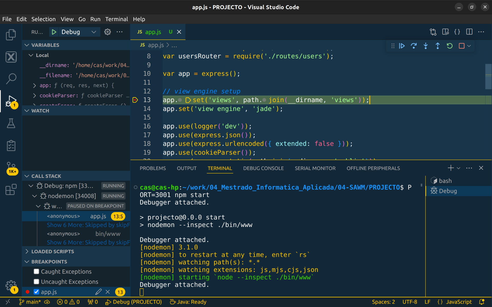
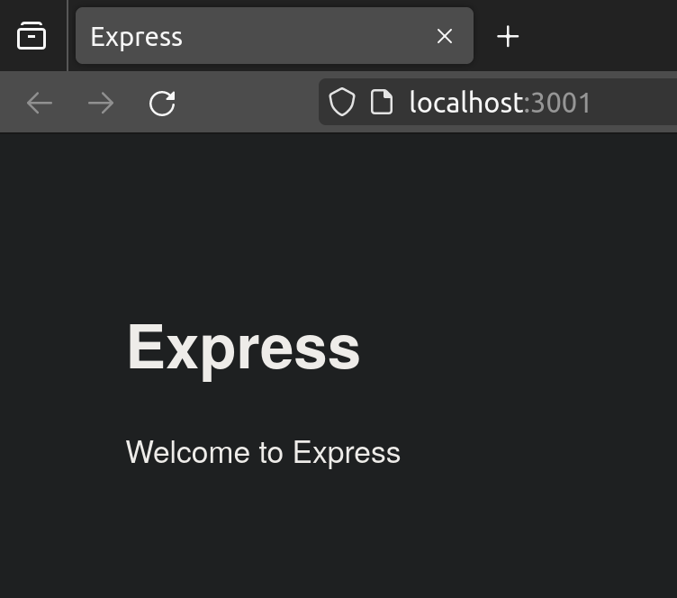
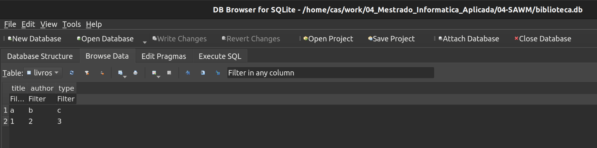

- [Express](#express)
- [Base de dados](#base-de-dados)

# Express

Setup inicial projecto:

- npx express-generator
    
- npm install nodemon
    
- npm install
    
- no package.json, substituir
    
    - “start” …
        - por
    - “start”: “nodemon --inspect ./bin/www”
- Criar o ficheiro .vscode/launch.json com o seguinte conteúdo:
    

```json
{
    "version": "0.2.0",
    "configurations": [
      {
        "command": "PORT=3001 npm start",
        "name": "Debug",
        "request": "launch",
        "type": "node-terminal"
      },
      {
        "name": "Attach to Nodemon",
        "type": "node",
        "request": "attach",
        "port": 9229, // Adjust if Nodemon uses a different port
        "address": "localhost", // Adjust if using a different host
        "restart": true,
        "sourceMaps": true, // Allow source maps for easier debugging
      },
    ]
}
```

Para iniciar o desenvolvimento com debug:

- colocar breakpoints onde for necessário para debug
<br>
- abrir a aplicação em: http://localhost:3001<br>


# Base de dados

Usado o DB Browser for SQLite para criar e editar a base de dados:<br/>
